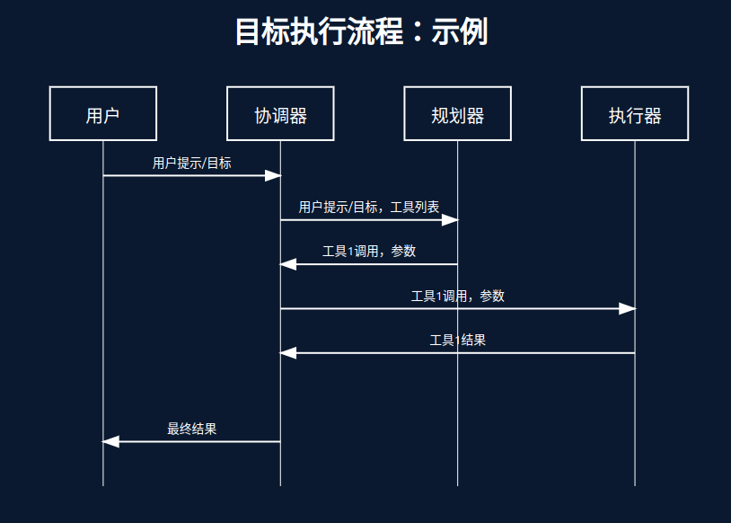

# AI Agent

执行流程说明：
1. 用户输入目标/提示
2. 协调器接收并转发给规划器
3. 规划器确定所需工具和参数
4. 执行器按计划执行任务
5. 结果通过协调器返回
6. 最终结果反馈给用户

### 参考
- [什么是 AI Agent - (英伟达)](https://blogs.nvidia.com/blog/what-is-agentic-ai/)
    - 数据 > 知识 > 行动
- [打造有效的 AI Agent - (克劳德)](https://www.anthropic.com/research/building-effective-agents)
    - 逻辑 > 感知 > 行动
- [AI Agent技术原理和应用 - (华为)](https://developer.huawei.com/consumer/cn/forum/topic/0202155833118560037)
    - 万字长文解析

