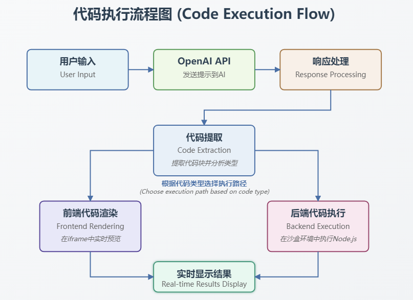

# ChatGPT Artifacts 项目分析 

## 1. 项目概述

ChatGPT Artifacts 是一个将 Claude 的 Artifacts 功能引入到 ChatGPT 的项目。该项目允许用户输入提示，获取 AI 生成的代码，并能够实时预览和执行这些代码。主要功能包括：

- 与 OpenAI API 集成，获取 AI 生成的响应
- 从 AI 响应中提取代码块
- 实时预览 React、HTML、CSS 和 JavaScript 代码
- 在沙盒环境中执行 Node.js 代码
- 支持多种 LLM 提供商（OpenAI、Ollama、Groq、Azure OpenAI）

## 2. 文件和文件夹结构

### 主要目录

- **components/**: 包含 React 组件
  - `Chat.jsx`: 主聊天界面组件
  - `PromptAndResponse.jsx`: 处理用户输入和 AI 响应
  - `CodeBlocks.jsx`: 显示和管理代码块
  - `CodeRenderer.jsx`: 在 iframe 中渲染代码预览
  - `AutoGrowingInput.jsx`: 自动增长的输入组件

- **contexts/**: 包含 React 上下文
  - `AppContext.jsx`: 应用状态管理

- **functions/**: 包含实用函数
  - `extractCodeFromBuffer.js`: 从 AI 响应中提取代码块
  - `transformImports.js`: 转换 React 导入语句
  - `clx.js`: 处理类名
  - `demoResponse.js`: 演示响应数据

- **pages/**: Next.js 页面
  - `index.jsx`: 主页
  - `_app.jsx`: Next.js 应用入口
  - `_document.jsx`: 自定义 HTML 文档
  - `api/chat.js`: 处理与 OpenAI API 的通信

- **server/**: 服务器相关代码
  - `init.js`: 服务器初始化
  - `execute.js`: 执行 Node.js 代码
  - `execute-react.js`: 执行 React 代码
  - `findAvailablePort.js`: 查找可用端口

- **styles/**: SCSS 样式文件

### 配置文件

- `package.json`: 项目依赖和脚本
- `nodemon.json`: Nodemon 配置
- `jsconfig.json`: JavaScript 配置
- `.env.example`: 环境变量示例

## 3. 技术栈

### 前端
- **React**: 用于构建用户界面
- **Next.js**: React 框架，用于服务端渲染和路由
- **Socket.io-client**: 用于实时通信
- **react-syntax-highlighter**: 代码语法高亮

### 后端
- **Node.js**: JavaScript 运行时
- **Next.js API Routes**: 处理 API 请求
- **Socket.io**: 用于实时通信
- **OpenAI API**: 与 AI 模型交互
- **child_process**: 用于执行代码

### 开发工具
- **Nodemon**: 自动重启服务器
- **SASS**: CSS 预处理器
- **Standard.js**: JavaScript 代码风格

## 4. 执行流程

1. **初始化**:
   - 服务器通过 `server/init.js` 启动
   - Next.js 应用初始化
   - Socket.io 服务器设置

2. **用户交互**:
   - 用户在 `PromptAndResponse` 组件中输入提示
   - 提示发送到 `/api/chat` API 端点

3. **AI 响应处理**:
   - API 端点使用 OpenAI API 获取响应
   - 响应以流的形式返回
   - `extractCodeFromBuffer` 函数从响应中提取代码块

4. **代码执行**:
   - 如果检测到 Node.js 代码（沙盒模式），使用 Socket.io 发送代码到服务器
   - 服务器使用 `execute.js` 在临时目录中创建文件并执行代码
   - 执行结果通过 Socket.io 返回给客户端

5. **代码预览**:
   - 对于前端代码（React、HTML、CSS、JavaScript），使用 `CodeRenderer` 组件在 iframe 中渲染预览

## 5. 核心逻辑和业务流程

### 数据流
1. 用户输入 → API 请求 → OpenAI API → 流式响应 → 代码提取 → 显示/执行

### 关键算法
- **代码提取**: 使用正则表达式从 AI 响应中提取代码块
- **导入转换**: 转换 React 导入语句以在浏览器中工作
- **代码执行**: 在隔离环境中安全执行 Node.js 代码

### API 集成
- OpenAI API: 使用流式响应获取 AI 生成的内容
- 支持多种 LLM 提供商（OpenAI、Ollama、Groq、Azure OpenAI）

## 6. 配置和环境设置

### 环境变量
- `OPENAI_API_KEY`: OpenAI API 密钥

### 设置步骤
1. 克隆仓库
2. 安装依赖: `npm install`
3. 复制 `.env.example` 为 `.env` 并添加 API 密钥
4. 构建应用: `npm run build`
5. 启动应用: `npm start`

## 7. 测试和调试

项目没有明确的测试文件，但包含以下错误处理机制：

- API 请求错误处理
- 代码执行错误捕获和显示
- 流处理错误处理

## 8. 项目复制计划

要复制这个项目，我们可以按照以下步骤进行：

1. **设置基础项目**:
   - 创建 Next.js 项目
   - 设置 SASS 和其他依赖
   - 配置环境变量

2. **实现核心组件**:
   - 创建聊天界面
   - 实现代码提取功能
   - 开发代码预览和执行功能

3. **集成 AI API**:
   - 设置 OpenAI API 集成
   - 实现流式响应处理

4. **添加代码执行功能**:
   - 实现 Node.js 代码执行
   - 设置 Socket.io 实时通信

5. **优化和测试**:
   - 测试不同类型的代码执行
   - 优化用户界面和体验

这个项目展示了如何将 AI 生成的代码与实时预览和执行功能结合，为学习 AI 和代码生成提供了很好的参考。
